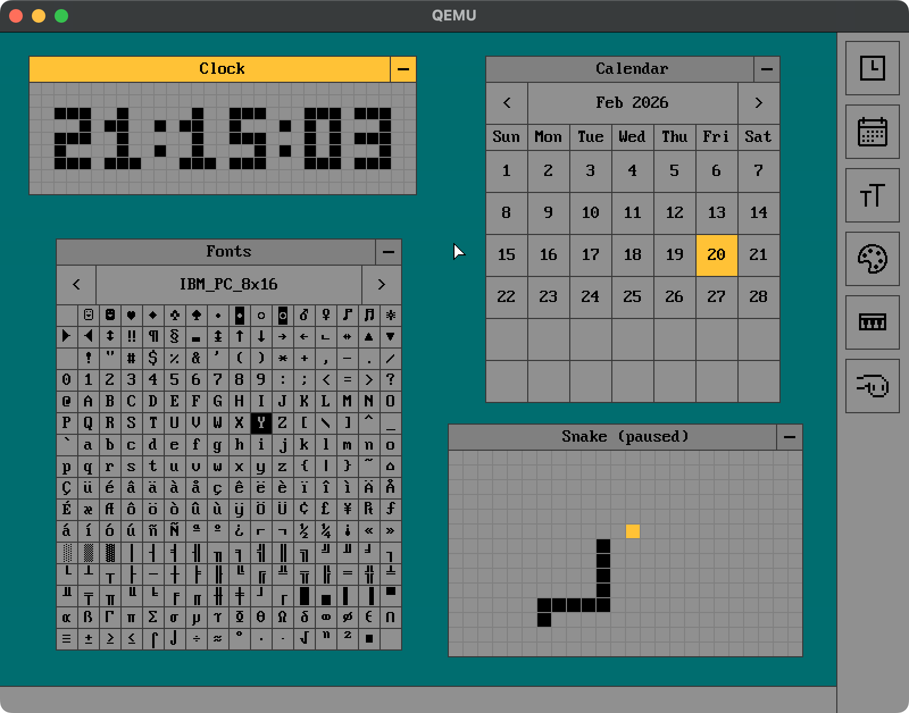

# gentleOS

A GUI-first, 32-bit, hobby operating system for vintage PCs



## Requirements

### Building

- GNU Make
- Clang (supporting i386 targets)
- Binutils (supporting i386 targets)
- NASM
- Mtools

### Running

- An i386-capable emulator (preferably QEMU)
- An i386 PC with BIOS (no guarantees, try at your own risk)

### Development

- cproto (for rebuilding includes)
- util-linux (for rebuilding disk image)
- GRUB (for rebuilding disk image)
- Python (for processing bitmaps)

## Building

- Copy `include/config.sample.h` to `include/config.h` and optionally edit
- Run `make`

## Testing ###

### QEMU

Run:

```bash
qemu-system-i386 -drive format=raw,file=build/disk.img -m 8 -debugcon stdio
```

For audio support on Macs, also add:

```
-audiodev coreaudio,id=snd0 -machine pcspk-audiodev=snd0
```

### Real hardware

If your device is capable of USB boot, just write the image file
to an empty pendrive:

```bash
dd if=build/disk.img of=<YOUR PENDRIVE> bs=1M conv=fsync
```

Otherwise, if you have GRUB installed, you can point it directly to
the kernel.elf file (see misc/grub.cfg)

## Attributions

- Icons by [Icons8](https://icons8.com/)
